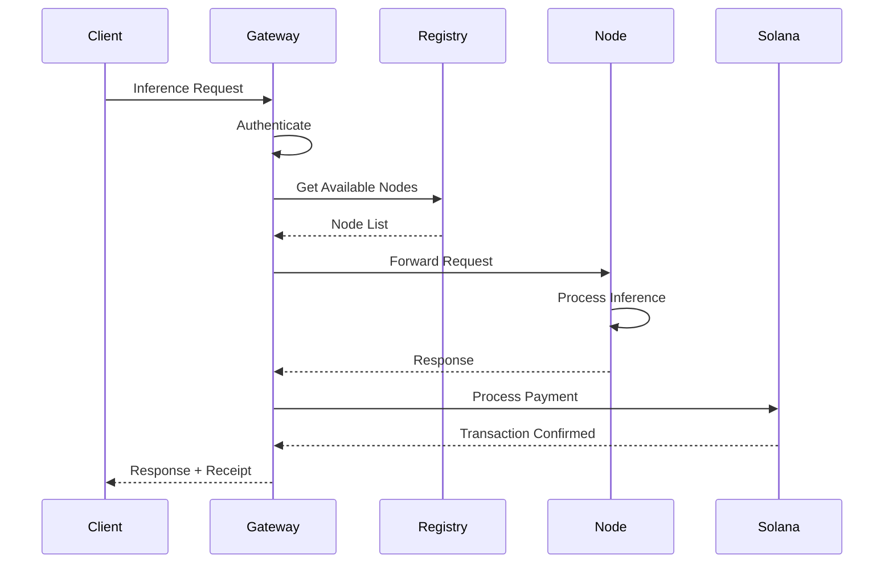

# Architecture Overview

SolanaLM is a hybrid decentralized network combining LLM inference and federated learning on Solana.

## System Architecture

```
┌────────────────────────────────────────────────────────────────────┐
│                         Client Layer                               │
│  ┌───────────┐  ┌───────────┐  ┌───────────┐  ┌────────────────┐  │
│  │ Python SDK│  │ OpenAI API│  │ Web UI    │  │ Terminal TUI   │  │
│  └─────┬─────┘  └─────┬─────┘  └─────┬─────┘  └───────┬────────┘  │
└────────┼──────────────┼──────────────┼────────────────┼────────────┘
         │              │              │                │
         └──────────────┴──────────────┴────────────────┘
                                │
┌───────────────────────────▼────────────────────────────────────────┐
│                        Gateway Layer                                │
│  ┌──────────────────────────────────────────────────────────────┐  │
│  │                     Gateway Server                            │  │
│  │  • Request routing      • Load balancing                      │  │
│  │  • Authentication       • Rate limiting                       │  │
│  │  • OpenAI compatibility • Metrics collection                  │  │
│  └──────────────────────────────────────────────────────────────┘  │
│  ┌──────────────┐  ┌──────────────┐  ┌──────────────────────────┐  │
│  │ Node Registry│  │  Training    │  │    Privacy Manager       │  │
│  │              │  │  Coordinator │  │                          │  │
│  └──────────────┘  └──────────────┘  └──────────────────────────┘  │
└───────────────────────────┬────────────────────────────────────────┘
                            │
┌───────────────────────────▼────────────────────────────────────────┐
│                         Node Layer                                  │
│  ┌────────────────┐  ┌────────────────┐  ┌────────────────────┐   │
│  │ Inference Node │  │ Training Node  │  │    Proxy Node      │   │
│  │ • PyTorch      │  │ • Fed. Learning│  │ • OpenAI API       │   │
│  │ • Transformers │  │ • DP Training  │  │ • Anthropic API    │   │
│  │ • Model Cache  │  │ • Aggregation  │  │ • Rate Management  │   │
│  └────────────────┘  └────────────────┘  └────────────────────┘   │
└───────────────────────────┬────────────────────────────────────────┘
                            │
┌───────────────────────────▼────────────────────────────────────────┐
│                       Blockchain Layer                              │
│  ┌──────────────────────────────────────────────────────────────┐  │
│  │                    Solana Network                             │  │
│  │  • Payment processing   • Transaction verification           │  │
│  │  • Wallet management    • Smart contract execution           │  │
│  └──────────────────────────────────────────────────────────────┘  │
└────────────────────────────────────────────────────────────────────┘
```

## User Interfaces

SolanaLM provides multiple interfaces for interacting with the network:

### Web Dashboard

A Vue.js-based web interface for visual monitoring:

- Real-time metrics and charts
- Node management UI
- Training round visualization
- Earnings tracking

**Location:** `frontend/`

```bash
cd frontend && npm run dev
```

### Terminal TUI

A Textual-based terminal dashboard for command-line users:

- Dashboard with node status
- Live log streaming
- Training monitoring
- SSH-friendly operation

**Location:** `core/tui/`

```bash
python -m core.tui --node-url http://localhost:8100
```

### Python SDK

Programmatic access for automation and integration:

```python
async with SolanaLMClient("http://localhost:8001") as client:
    response = await client.inference(...)
```

**Location:** `client/python/`

## Core Components

### Gateway Server

The central coordination point for all network operations.

**Responsibilities:**

- Route inference requests to appropriate nodes
- Balance load across available nodes
- Authenticate and authorize requests
- Collect metrics and health data
- Coordinate federated learning rounds

**Location:** `core/gateway/server.py`

```python
from core.gateway.server import GatewayServer

gateway = GatewayServer(
    host="0.0.0.0",
    port=8001,
    registry=node_registry,
    coordinator=training_coordinator
)
await gateway.start()
```

### Node Registry

Tracks all nodes in the network and their capabilities.

**Responsibilities:**

- Node discovery and registration
- Health monitoring
- Capability tracking
- Node selection for requests

**Location:** `core/registry/node_registry.py`

```python
from core.registry.node_registry import NodeRegistry

registry = NodeRegistry()
await registry.register_node(node_info)
nodes = await registry.get_available_nodes(model="gpt2")
```

### Training Coordinator

Orchestrates federated learning across the network.

**Responsibilities:**

- Training round management
- Participant selection
- Model aggregation
- Reward distribution

**Location:** `core/coordinator/training_coordinator.py`

### Payment Client

Handles all Solana blockchain interactions.

**Responsibilities:**

- Transaction creation and signing
- Balance verification
- Payment processing
- Fee management

**Location:** `core/payments/solana_client.py`

## Data Flow

### Inference Request Flow

```
1. Client sends request to Gateway
2. Gateway authenticates wallet
3. Gateway queries Registry for capable nodes
4. Gateway selects node (load balancing)
5. Request forwarded to selected node
6. Node processes inference
7. Response returned to Gateway
8. Payment processed via Solana
9. Response returned to client
```

### Training Flow

```
1. Coordinator announces training round
2. Nodes register interest
3. Coordinator selects participants
4. Global model distributed to nodes
5. Nodes train locally (with DP)
6. Nodes submit encrypted updates
7. Coordinator aggregates updates
8. New global model created
9. Rewards distributed via Solana
```

## Component Interactions



## Scalability Design

### Horizontal Scaling

- **Nodes**: Unlimited nodes can join the network
- **Gateway**: Stateless design allows multiple instances
- **Registry**: Distributed caching with Redis

### Load Distribution

```
┌────────────────────────────────────────────┐
│              Load Balancer                 │
│         (HAProxy / Nginx / K8s)            │
└──────────────┬────────────────┬────────────┘
               │                │
      ┌────────▼────┐   ┌───────▼─────┐
      │  Gateway 1  │   │  Gateway 2  │
      └──────┬──────┘   └──────┬──────┘
             │                 │
      ┌──────▼─────────────────▼──────┐
      │        Shared Services         │
      │  • Redis (cache)              │
      │  • PostgreSQL (data)          │
      │  • Prometheus (metrics)       │
      └────────────────────────────────┘
```

### Node Selection Algorithm

```python
def select_node(request, available_nodes):
    # Filter by capability
    capable = [n for n in available_nodes
               if request.model in n.supported_models]

    # Sort by criteria
    scored = [(n, score_node(n, request)) for n in capable]
    scored.sort(key=lambda x: x[1], reverse=True)

    return scored[0][0]

def score_node(node, request):
    score = 0
    score += node.success_rate * 30      # Reliability
    score += (1 / node.avg_latency) * 20 # Speed
    score += (1 / node.current_load) * 30 # Availability
    score += node.reputation * 20         # Trust
    return score
```

## Security Architecture

### Authentication Layers

```
Layer 1: Wallet Address Verification
         └─ Validates Solana wallet format

Layer 2: Signature Verification (Optional)
         └─ Verifies wallet ownership via signature

Layer 3: Rate Limiting
         └─ Prevents abuse per wallet

Layer 4: Balance Verification
         └─ Ensures sufficient funds
```

### Privacy Layers

```
Layer 1: TLS Encryption
         └─ All traffic encrypted

Layer 2: Onion Routing (Optional)
         └─ Multi-hop request routing

Layer 3: Anonymous Payments
         └─ Payment mixing

Layer 4: Differential Privacy (Training)
         └─ Protects training data
```

## Configuration Management

```python
# core/config/settings.py
from pydantic import BaseSettings

class Settings(BaseSettings):
    # Network
    solana_network: str = "devnet"
    solana_rpc_url: str = None

    # Gateway
    gateway_host: str = "localhost"
    gateway_port: int = 8001

    # Security
    jwt_secret: str = None
    rate_limit_per_minute: int = 100

    # Database
    database_url: str = "sqlite:///./dev.db"

    class Config:
        env_file = ".env"
```

## Next Steps

- [Node Types](nodes.md) - Detailed node architecture
- [Payment System](payments.md) - Blockchain integration
- [Deployment](../deployment/docker.md) - Production deployment
