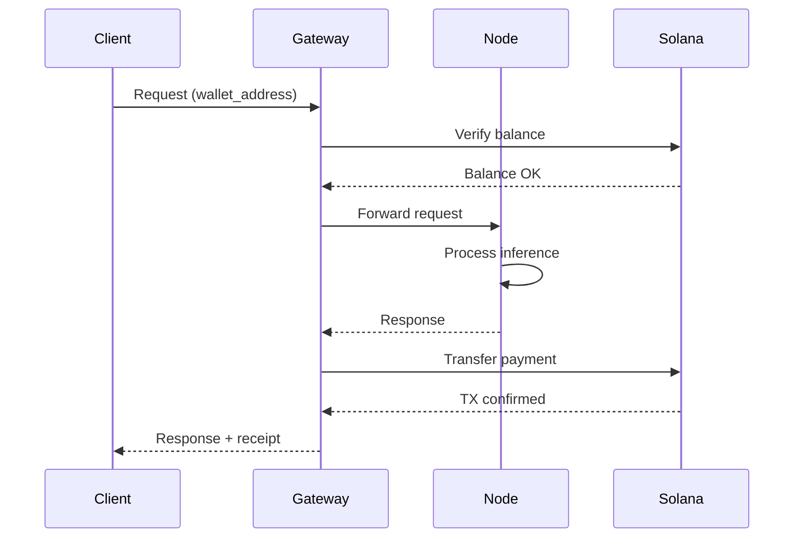

# Payment System

SolanaLM uses Solana blockchain for all payments, enabling fast, low-cost transactions.

## Overview

```
┌───────────────────────────────────────────────────────────────┐
│                    Payment Flow                                │
│                                                                │
│  ┌──────────┐    ┌──────────┐    ┌──────────┐    ┌─────────┐ │
│  │  Client  │───▶│  Gateway │───▶│   Node   │───▶│ Solana  │ │
│  │  Wallet  │    │          │    │  Wallet  │    │ Network │ │
│  └──────────┘    └──────────┘    └──────────┘    └─────────┘ │
│       │                                               │       │
│       └───────────────────────────────────────────────┘       │
│                    Transaction Flow                            │
└───────────────────────────────────────────────────────────────┘
```

## Payment Architecture

### Components

| Component | Purpose |
|-----------|---------|
| **Payment Client** | Solana SDK wrapper |
| **Transaction Manager** | Transaction creation and signing |
| **Balance Checker** | Wallet balance verification |
| **Fee Calculator** | Dynamic pricing engine |

### Payment Client

```python
# core/payments/solana_client.py
from solana.rpc.api import Client
from solana.transaction import Transaction

class SolanaPaymentClient:
    def __init__(
        self,
        rpc_url: str = "https://api.devnet.solana.com",
        network: str = "devnet"
    ):
        self.client = Client(rpc_url)
        self.network = network

    async def transfer(
        self,
        from_wallet: str,
        to_wallet: str,
        amount_sol: float
    ) -> str:
        """Transfer SOL between wallets"""
        lamports = int(amount_sol * 1_000_000_000)

        transaction = Transaction()
        transaction.add(
            transfer(
                TransferParams(
                    from_pubkey=PublicKey(from_wallet),
                    to_pubkey=PublicKey(to_wallet),
                    lamports=lamports
                )
            )
        )

        # Sign and send
        result = await self.client.send_transaction(
            transaction,
            self.keypair
        )

        return result['result']

    async def get_balance(self, wallet: str) -> float:
        """Get wallet balance in SOL"""
        response = await self.client.get_balance(
            PublicKey(wallet)
        )
        lamports = response['result']['value']
        return lamports / 1_000_000_000
```

## Payment Flow

### Inference Payment

```
1. Client submits request with wallet address
2. Gateway verifies wallet has sufficient balance
3. Request forwarded to node for processing
4. Node completes inference
5. Gateway calculates cost based on tokens
6. Payment transferred: Client → Node
7. Network fee deducted: Node → Network
8. Transaction confirmed on Solana
9. Response returned to client with receipt
```

### Sequence Diagram



## Pricing Model

### Cost Calculation

```python
def calculate_cost(
    tokens_generated: int,
    model_tier: str,
    privacy_level: str = "standard"
) -> float:
    """Calculate request cost in SOL"""

    # Base cost per token
    base_costs = {
        "small": 0.0000001,   # DialoGPT-small
        "medium": 0.0000005,  # DialoGPT-medium
        "large": 0.000001,    # GPT-2 large
        "proxy": 0.000002     # External API
    }

    base_cost = base_costs.get(model_tier, 0.0000005)
    token_cost = base_cost * tokens_generated

    # Privacy multiplier
    privacy_multipliers = {
        "standard": 1.0,
        "high": 1.5
    }
    privacy_cost = token_cost * privacy_multipliers.get(privacy_level, 1.0)

    # Network fee (5%)
    network_fee = privacy_cost * 0.05

    return privacy_cost + network_fee
```

### Dynamic Pricing

```python
class DynamicPricer:
    def __init__(self):
        self.base_price = 0.0000005
        self.demand_factor = 1.0

    def get_price(self, model: str) -> float:
        """Get current price considering demand"""
        base = self.base_price

        # Demand adjustment
        current_load = self.get_network_load()
        if current_load > 0.8:
            self.demand_factor = 1.5
        elif current_load > 0.6:
            self.demand_factor = 1.2
        else:
            self.demand_factor = 1.0

        return base * self.demand_factor
```

## Training Rewards

### Reward Distribution

```python
def distribute_rewards(
    round_id: str,
    participants: List[str],
    total_reward: float,
    contributions: Dict[str, float]
) -> Dict[str, float]:
    """Distribute training rewards based on contribution"""

    # Normalize contributions
    total_contribution = sum(contributions.values())

    rewards = {}
    for participant in participants:
        share = contributions[participant] / total_contribution
        rewards[participant] = total_reward * share

    return rewards
```

### Contribution Factors

| Factor | Weight | Description |
|--------|--------|-------------|
| Data size | 30% | Amount of training data |
| Compute time | 25% | Time spent training |
| Update quality | 25% | Improvement to global model |
| Reliability | 20% | Completion rate |

## Network Fees

### Fee Structure

```python
NETWORK_FEES = {
    "inference": 0.05,     # 5% of inference cost
    "training": 0.03,      # 3% of training reward
    "proxy": 0.02,         # 2% of proxy commission
    "privacy": 0.10        # 10% for privacy features
}
```

### Fee Distribution

```
Network Fee Pool
       │
       ├──▶ 40% Development Fund
       │
       ├──▶ 30% Node Incentives
       │
       ├──▶ 20% Security Fund
       │
       └──▶ 10% Community Treasury
```

## Anonymous Payments

### Payment Mixing

```python
from core.privacy.anonymous_payments import AnonymousPaymentManager

class PaymentMixer:
    def __init__(self, pool_size: int = 100):
        self.mixing_pool = []
        self.pool_size = pool_size

    async def mix_payment(
        self,
        amount: float,
        source: str,
        destination: str
    ) -> str:
        """Mix payment through the pool"""

        # Add to pool
        self.mixing_pool.append({
            "amount": amount,
            "source": source,
            "destination": destination,
            "timestamp": time.time()
        })

        # Random delay
        delay = random.uniform(10, 60)
        await asyncio.sleep(delay)

        # Execute from pool in random order
        if len(self.mixing_pool) >= self.pool_size:
            await self.flush_pool()

        return "mixed_tx_id"
```

## Transaction Verification

### Confirmation Handling

```python
async def wait_for_confirmation(
    self,
    tx_signature: str,
    max_retries: int = 30
) -> bool:
    """Wait for transaction confirmation"""

    for attempt in range(max_retries):
        response = await self.client.get_transaction(
            tx_signature,
            commitment="confirmed"
        )

        if response.get('result'):
            return True

        await asyncio.sleep(1)

    raise TransactionNotConfirmedError(tx_signature)
```

### Receipt Generation

```python
@dataclass
class PaymentReceipt:
    transaction_id: str
    from_wallet: str
    to_wallet: str
    amount_sol: float
    network_fee: float
    timestamp: str
    block_number: int
    status: str

def generate_receipt(transaction) -> PaymentReceipt:
    return PaymentReceipt(
        transaction_id=transaction.signature,
        from_wallet=str(transaction.from_pubkey),
        to_wallet=str(transaction.to_pubkey),
        amount_sol=transaction.lamports / 1e9,
        network_fee=transaction.fee / 1e9,
        timestamp=datetime.utcnow().isoformat(),
        block_number=transaction.slot,
        status="confirmed"
    )
```

## Network Environments

### Development (Simulated)

```python
class SimulatedPaymentClient:
    """Simulated payments for development"""

    def __init__(self):
        self.balances = {}

    async def transfer(self, from_w, to_w, amount):
        self.balances[from_w] -= amount
        self.balances[to_w] = self.balances.get(to_w, 0) + amount
        return f"sim_tx_{uuid.uuid4()}"
```

### Devnet

```python
client = SolanaPaymentClient(
    rpc_url="https://api.devnet.solana.com",
    network="devnet"
)
# Get free test SOL
await client.request_airdrop(wallet, 1.0)
```

### Mainnet

```python
client = SolanaPaymentClient(
    rpc_url="https://api.mainnet-beta.solana.com",
    network="mainnet-beta"
)
# Real SOL required
```

## Error Handling

### Common Errors

```python
class InsufficientFundsError(Exception):
    """Wallet has insufficient SOL"""
    pass

class TransactionFailedError(Exception):
    """Transaction failed to confirm"""
    pass

class RateLimitedError(Exception):
    """RPC rate limited"""
    pass
```

### Retry Logic

```python
async def transfer_with_retry(
    self,
    from_wallet: str,
    to_wallet: str,
    amount: float,
    max_retries: int = 3
) -> str:
    """Transfer with automatic retry"""

    for attempt in range(max_retries):
        try:
            return await self.transfer(from_wallet, to_wallet, amount)
        except RateLimitedError:
            await asyncio.sleep(2 ** attempt)
        except TransactionFailedError:
            if attempt == max_retries - 1:
                raise

    raise TransactionFailedError("Max retries exceeded")
```

## Best Practices

### Security

- Never expose private keys
- Use hardware wallets for production
- Implement rate limiting
- Monitor for suspicious activity

### Performance

- Batch small payments
- Use commitment level "confirmed"
- Cache balance checks
- Pre-sign transactions when possible

### Cost Optimization

- Monitor network fees
- Use priority fees during congestion
- Batch training rewards
- Implement payment pooling

## Next Steps

- [Architecture Overview](overview.md) - System design
- [Node Types](nodes.md) - Node architecture
- [Privacy Features](../guides/privacy.md) - Anonymous payments
